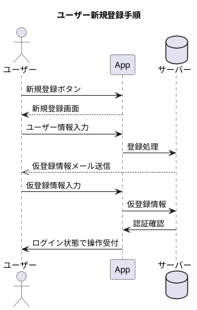
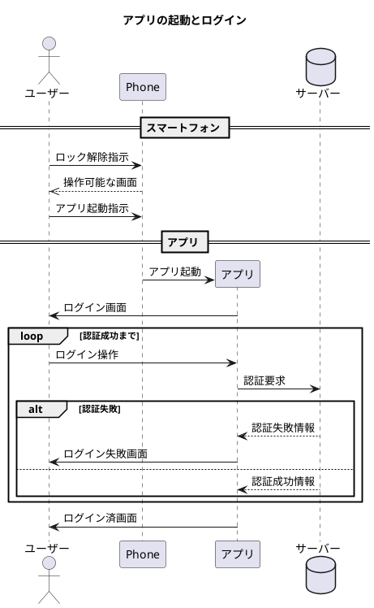

# アプリのセキュリティについて

スマートフォンアプリのセキュリティは、大きく2つの場面に分けられます。

一つはスマートフォン本体側、もう一つはアプリ側のセキュリティです。

次の図は、ログインが必要なアプリを使用する手順を例示したものです。

## 新規ユーザー登録

ユーザーの登録をアプリから行う場合は、一連の登録手続きを行う必要があります。

この手続きでは、メールを別途送付しています。これには、２つ理由があります。

1. 登録メールアドレスは、アプリ利用者が使用しており、到達することを確認する
1. メールによるパスワードリセット可能にする

アプリ利用者に届くメールが登録されていないと、パスワードを忘れた場合の復帰が不可能になってしまいます。

※一般にパスワードそのものは、どこにも保存されず、復元できません。

### サーバーとローカル

ローカル（手元側）にだけパスワードなど認証情報を保存している場合は、外部との接触の機会が減ります。

そのため、情報の外部流出機会も減ります。

ただし、パスワード忘れた場合に、パスワードリセットを行って復帰することは困難です。

また、バックアップをサーバーに作成することは、端末の故障などに対する有効な手段です。