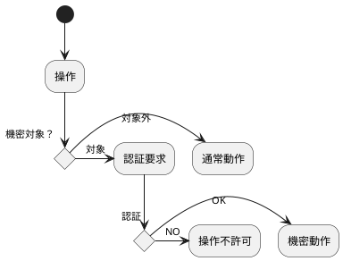

# アプリのセキュリティについて

スマートフォンアプリのセキュリティは、大きく2つの場面に分けられます。

一つはスマートフォン本体側、もう一つはアプリ側のセキュリティです。

次の図は、ログインが必要なアプリを使用する手順を例示したものです。

## 新規ユーザー登録

ユーザーの登録をアプリから行う場合は、一連の登録手続きを行う必要があります。

この手続きでは、メールを別途送付しています。これには、２つ理由があります。

1. 登録メールアドレスは、アプリ利用者が使用しており、到達することを確認する
1. メールによるパスワードリセット可能にする

アプリ利用者に届くメールが登録されていないと、パスワードを忘れた場合の復帰が不可能になってしまいます。

※一般にパスワードそのものは、どこにも保存されず、復元できません。

### サーバーとローカル

ローカル（手元側）にだけパスワードなど認証情報を保存している場合は、外部との接触の機会が減ります。

そのため、情報の外部流出機会も減ります。

ただし、パスワード忘れた場合に、パスワードリセットを行って復帰することは困難です。

また、バックアップをサーバーに作成することは、端末の故障などに対する有効な手段です。

## 再認証

ログイン中であっても、特定のページへのアクセスをするときに改めてパスワードなどの認証を求めるデザインがあります。

認証情報を知っている人が操作していることを確認し、追加のセキュリティを確保します。

認証情報の変更、アカウント削除、などの重要な動作に対して用いられることが多いです。

## 認証期間

一度認証したらいつまで認証を有効にするか、利便性とセキュリティのバランスをとることが必要です。

- ログイン認証
  - ログインから一定時間で認証切れ
  - アプリの休止から復帰時に認証を求める
  - アプリ終了で認証切れ

- 機密操作認証
  - 一連の操作を終えるまで
  - 一定時間経過

ログイン認証は数日有効で、休止や終了時に認証を求めないものもあります。

機密操作の再認証は、そもそも再認証を設定していないものもあります。

設定がある場合には、「削除」などのタイミングで認証を求め、その操作のみを行って認証は終了します。

閲覧操作などの場合は、数分で認証期限切れとなる場合が多いです。